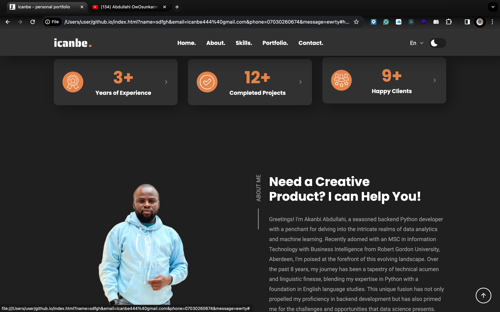

<div align="center">
<!--   
  
  
  
[](https://twitter.com/intent/follow?screen_name=codewithsadee_)
  [](https://youtu.be/DdlVKS7MROY) -->

  <br />
  <br />
  
  

  <h2 align="center">icanbe - Personal portfolio</h2>

  This website is fully responsive personal portfolio, <br />Responsive for all devices, built using HTML, CSS, and JavaScript.

  <a href="https://icanbe444.github.io/github.io/index.html"><strong>➥ Live Demo</strong></a>

</div>

<br />

### Demo Screeshots



### Prerequisites

Before you begin, ensure you have met the following requirements:

* [Git](https://git-scm.com/downloads "Download Git") must be installed on your operating system.

### Run Locally

To run repo locally, run this command on your git bash:

Linux and macOS:

```bash
sudo git clone git@github.com:icanbe444/github.io.git
```

Windows:

```bash
git clone git@github.com:icanbe444/github.io.git
```

### Contact
Be sure to have your ssh credentials ready and setup before cloning this repository.
If you want to contact the owner of this theme, you can reach him at [Twitter](https://www.twitter.com/codewithsadee).

### License

This project is **free to use** and does not contains any license.
